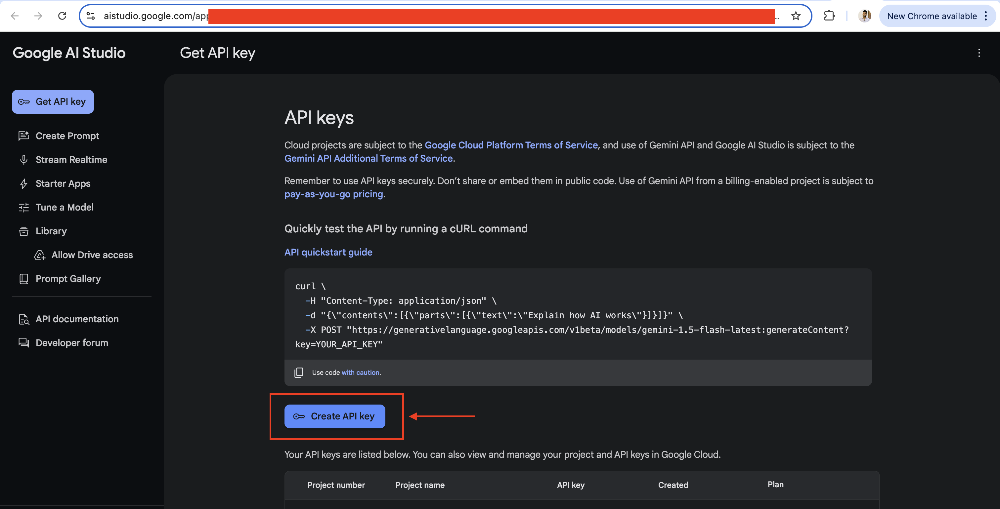
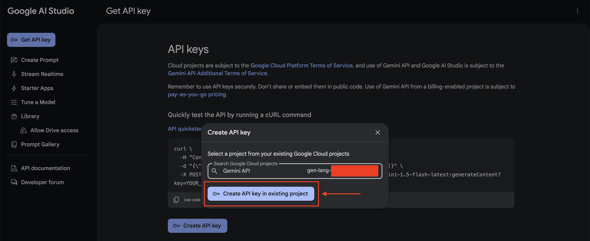
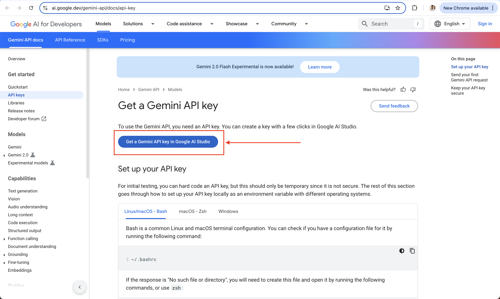

# Gemini Connector - README

## Overview

Gemini is Google's most advanced and versatile AI model, designed to process and integrate diverse types of information, including text, code, audio, images, and video. This multimodal capability allows Gemini to perform a wide range of tasks across platforms, from data centers to mobile devices. The initial release, Gemini 1.0, comes in three optimized sizes:

- **Gemini Ultra**: The largest and most powerful model, ideal for highly complex tasks.
- **Gemini Pro**: A versatile model suited for a wide array of applications.
- **Gemini Nano**: An efficient model designed for on-device tasks, bringing AI capabilities to mobile devices.

This milestone reflects Google’s commitment to creating intuitive and expert AI assistants that enhance productivity and user interactions. For more details, visit the [official Google AI blog](https://blog.google/technology/ai/google-gemini-ai/?utm_source=chatgpt.com).

## Setup Guide

To use the Gemini connector, you need a Google account with API access. Follow the steps below to obtain an API key and configure access.

### Step 1: Create an API Key

1. Go to the [API Key Documentation](https://ai.google.dev/gemini-api/docs/api-key).
   

2. Click **"Create API Key"** to generate a new API key.
   

3. If you have an existing project, select it. Otherwise, create a new project to proceed.
   

### Step 2: Configure the API Key

1. Create a `Config.toml` file and configure the credentials obtained in the previous step:
   ```toml
   accessToken = "<Your Access Token for Gemini>"
   apiKey = "<Your Google API Key>"
   ```

2. Initialize the connection configuration in your application:
   ```ballerina
   configurable string baseUrl = ?;
   configurable string apiToken = ?;
   configurable string apiKey = ?;

   gemini:ConnectionConfig config = {
       auth: <http:CredentialsConfig> {
           username: username,
           password: apiToken
       }
   };
   final gemini:Client gemini = check new(config, baseUrl);
   ```

## Quickstart

### Step 1: Import the Module
Import the Gemini module in your application:
```ballerina
import ballerinax/gemini;
```

### Step 2: Instantiate a Connector
Initialize the Gemini connector with the configuration details:
```ballerina
final gemini:Client gemini = check new(config, baseUrl);
```

### Step 3: Invoke Operations
Use the connector's methods to interact with Gemini’s features.

### Step 4: Run the Application
Execute the Ballerina application to interact with the Gemini APIs.

## Examples

The Gemini connector includes practical examples demonstrating various use cases. Explore the [examples directory](https://github.com/module-ballerinax-googleapis.gemini/tree/main/examples/) for more information.

[//]: # (TODO: Add detailed examples for specific use cases)
